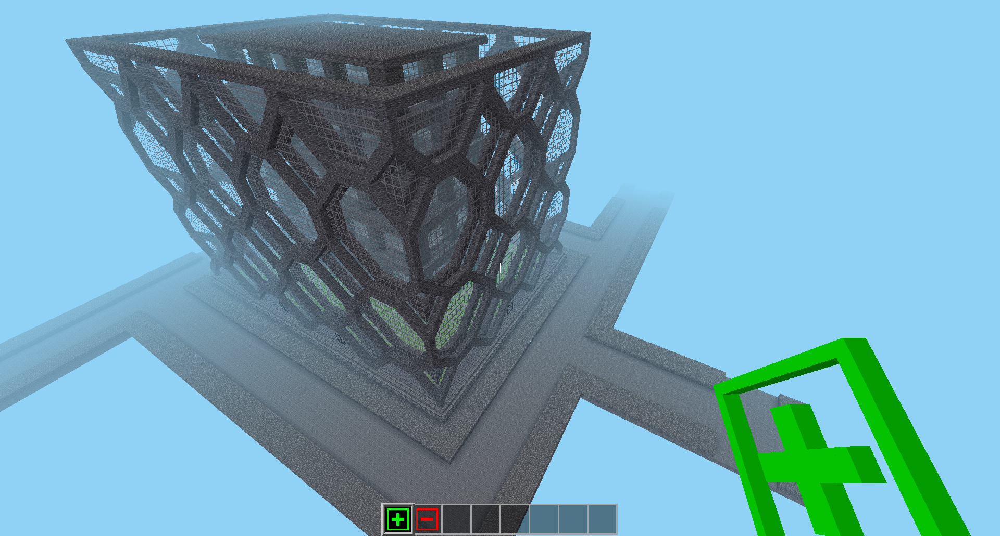

# mapblock_tileset

Tileset placement engine for minetest


[](license.txt)
[](https://content.minetest.net/packages/BuckarooBanzay/mapblock_tileset)



(buildings and streets not included)

# Overview

Places mapblocks from a mapblock-catalog to the world according to the predefined rules

# Dependencies

* `mapblock_lib` https://github.com/BuckarooBanzay/mapblock_lib

# Api

Tileset and rules for a simple street, for more examples see: https://github.com/BuckarooBanzay/mapblock_tileset_city

Placement via the `mapblock_tileset:place` tool or the `/tile_place` command, in this example: `/tile_place street`

```lua
local MP = minetest.get_modpath(minetest.get_current_modname())

-- SPEC V2
mapblock_tileset.register_tileset("street", {
    catalog = MP .. "/schematics/street.zip",
    tiles = {
        -- straight street
        {
            positions = {{x=0,y=0,z=0}},
            size = {x=1,y=1,z=1}, -- optional, defaults to 1x1x1
            rotations = {0,90},
            -- connections / rules
            connections = {
                {
                    type = "street",
                    position = {x=0,y=0,z=0}, -- optional, defaults to 0,0,0
                    direction = {x=1,y=0,z=0}
                },{
                    type = "street",
                    position = {x=0,y=0,z=0}, -- optional, defaults to 0,0,0
                    direction = {x=-1,y=0,z=0},
                    optional = true -- doesn't have to match
                }
            }
        }
    }
})
```

# License

* Code: `MIT`
* Textures: `CC-BY-SA-3.0`